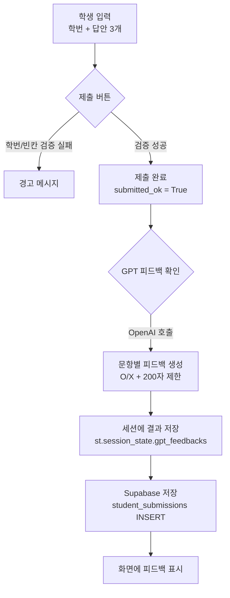

# Streamlit 서술형 3문항 채점·피드백 + Supabase 저장 예시

이 프로젝트는 **Streamlit**으로 서술형 문항(총 3개)을 제출받고, **OpenAI GPT 모델**로 문항별 **O/X 판정 + 짧은 피드백**을 생성한 뒤, 결과를 **Supabase DB**에 저장하는 예시 코드입니다.

---

## 전체 흐름(요약)

* 학생이 **학번 + 3개 문항 답안**을 작성하고 **제출**
* 제출이 정상 처리되면 **GPT 피드백 확인 버튼**이 활성화됨
* 버튼 클릭 시

  * 문항별 채점 기준(GRADING_GUIDELINES)을 바탕으로 GPT 호출
  * 응답을 `O: ...` 또는 `X: ...` 형태로 **정규화(normalize)**
  * 결과를 세션 상태에 저장
  * **Supabase** 테이블에 **답안/피드백/기준/모델명**을 저장

---

## 간단 그래픽(흐름도)



---

## 주요 기능 설명

### 1) Step 1-2: 3문항 제출 폼

* `st.form()` 안에 입력 요소를 묶어 **한 번에 제출**합니다.
* 검증 로직:

  * 학번이 비어 있으면 경고
  * 답안 중 빈 칸이 있으면 경고
  * 모두 통과하면 성공 메시지 + 세션 상태 플래그 설정

핵심 세션 상태:

* `st.session_state.submitted_ok = True`
* `st.session_state.gpt_feedbacks = None` (재제출 시 이전 피드백 초기화)

### 2) Step 2: GPT 채점 + 피드백

* `GPT 피드백 확인` 버튼은 **제출 성공 후에만** 활성화됩니다.
* 문항별 채점 기준은 `GRADING_GUIDELINES`에 작성합니다(교사가 자유롭게 수정).

#### 응답 포맷 강제: `normalize_feedback()`

모델 출력이 흔들려도 다음 규칙으로 보정합니다.

* 첫 줄만 사용
* 접두사를 `O:` 또는 `X:`로 강제
* 본문 200자 제한

### 3) Supabase 저장

* `save_to_supabase(payload)`에서 Supabase 테이블에 **한 행(row)**을 삽입합니다.
* 저장 데이터 예시:

  * `student_id`
  * `answer_1~3`
  * `feedback_1~3`
  * `guideline_1~3`
  * `model`
  * `created_at`은 DB 기본값(now()) 사용 권장

> ⚠️ 서비스 키(`SUPABASE_SERVICE_ROLE_KEY`)는 **절대 클라이언트에 노출하면 안 됩니다.**

---

## 프로젝트 구조(권장)

예시:

* `app.py` (Streamlit 메인)
* `.streamlit/secrets.toml`
* `README.md`

---

## 설치 및 실행

### 1) 패키지 설치

```bash
pip install streamlit openai supabase
```

### 2) secrets 설정

Streamlit은 `.streamlit/secrets.toml`에서 비밀키를 읽습니다.

```toml
OPENAI_API_KEY = "YOUR_OPENAI_API_KEY"
SUPABASE_URL = "https://xxxx.supabase.co"
SUPABASE_SERVICE_ROLE_KEY = "YOUR_SERVICE_ROLE_KEY"
```

### 3) 실행

```bash
streamlit run app.py
```

---

## Supabase 테이블 예시 스키마

테이블 이름: `student_submissions`

권장 컬럼(예시):

* `id` (uuid, PK, default gen_random_uuid())
* `student_id` (text)
* `answer_1` (text)
* `answer_2` (text)
* `answer_3` (text)
* `feedback_1` (text)
* `feedback_2` (text)
* `feedback_3` (text)
* `guideline_1` (text)
* `guideline_2` (text)
* `guideline_3` (text)
* `model` (text)
* `created_at` (timestamptz, default now())

> 컬럼명은 코드의 `row = {...}` 키와 일치해야 합니다.

---

## 모델/비용 관련 팁

* 예시 모델: `gpt-5-mini`
* 답안이 비어 있으면 호출하지 않도록 방어 로직을 두었습니다.
* 문항 수가 늘어나면 호출 횟수도 증가하므로

  * 문항 묶음 평가(한 번 호출로 여러 문항 처리)
  * 토큰 제한(응답 길이 제한)
    등을 고려하세요.

---

## 보안 체크리스트(중요)

* ✅ `SUPABASE_SERVICE_ROLE_KEY`는 서버 전용입니다.

  * Streamlit Cloud/서버 환경의 secrets로만 관리
  * GitHub에 커밋 금지
* ✅ 학생 개인정보(학번 등)를 저장한다면

  * 접근 권한(RLS), 로그, 보관 기간 정책을 마련하세요.
* ✅ 필요하면 `SUPABASE_ANON_KEY` + RLS 정책으로 전환하고,
  서버 측 API(Edge Function 등)로 insert를 위임하는 방식도 고려하세요.

---

## 커스터마이징 포인트

* 문항 추가/수정: `QUESTION_1~3` / `answers` / `GRADING_GUIDELINES`
* 채점 기준 강화: 기준 문자열을 더 구체화(필수 키워드, 예시 포함)
* 출력 형식 변경: `normalize_feedback()` 수정
* DB 컬럼 확장: rubric 점수, 총점, 교사용 코멘트, 재채점 이력 등

---

## 문제 해결

* **openai 라이브러리 오류**

  * `pip install openai` 확인
* **secrets 누락 오류**

  * `.streamlit/secrets.toml`에 키가 정확히 있는지 확인
* **Supabase 저장 실패**

  * 테이블/컬럼명 일치 확인
  * 서비스 키 권한/프로젝트 URL 확인

---

## 라이선스

교육용 예시 코드입니다. 학교/기관 정책에 맞게 사용하세요.
